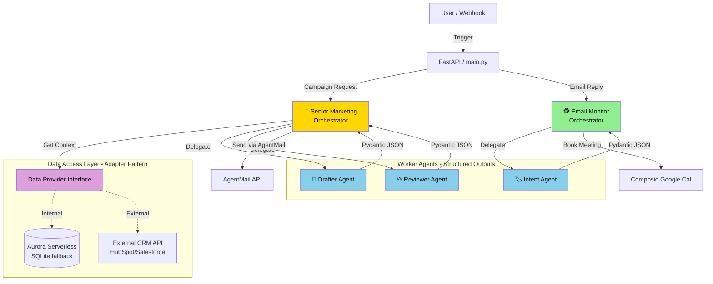

# Shiku: AI-Powered Sales Development Representative (SDR) Platform

Shiku is an enterprise-grade, AI-assisted sales outreach platform. It runs database-backed email campaigns, intelligently monitors inbound replies, classifies lead intent, and automatically coordinates follow-up meetings based on real staff availability. 

This repository has been significantly re-architected from its prototype phase to incorporate robust data layers, structured AI outputs, and enterprise-grade security guardrails.

## 🚀 Key Features & Upgrades

This project implements the "Alex Architecture" principles, focusing on reliability, security, and strict data contracts:

*   **Orchestrator-Worker Pattern**: Separation of concerns between marketing orchestration, drafting, and reviewing.
*   **Data Access Layer (Adapter Pattern)**: Seamlessly switch between local SQLite and external CRMs via `DATA_SOURCE` environment variables.
*   **Strict Structured Outputs**: All AI agents are forced to return strict Pydantic JSON schemas and employ Chain of Thought (`rationale` field first) to ensure deterministic outputs.
*   **Smart Calendar Scheduling**: Re-architected meeting booking to fetch real staff availability from the database and mathematically align proposed times, eliminating AI hallucinations and double-booking.
*   **Inbound Security Guardrails**: Integrates Llama Guard to validate inbound email webhooks, protecting the system against prompt injection attacks before they reach the core LLM logic.
*   **AWS & frontend**: Optional deploy to **Aurora Serverless v2 (PostgreSQL)** via RDS Data API, **App Runner** for the API, and a **Next.js** UI exported to **S3 + CloudFront** (see `docs/DEPLOY_AWS.md` and `terraform/README.md`).

## 🏗️ System Architecture

Our upgraded architecture implements the Orchestrator-Worker pattern, robust data layers, and structured AI outputs.



## Current Workflow

### Outbound Campaign Flow
1. Load an active campaign from the database (via Data Adapter).
2. Select an eligible lead.
3. Generate three email variants utilizing Pydantic structured outputs.
4. Evaluate and select the strongest draft.
5. Send one outbound email through AgentMail.

### Inbound Monitoring Flow
1. AgentMail sends a webhook to `POST /webhook`.
2. The app validates the event against **Llama Guard** for prompt injection.
3. The monitor extracts intent from the inbound message.
4. A response is generated and evaluated.
5. The system sends a reply. For `meeting_request` intents, it pulls the assigned SDR's actual availability JSON from the database and proposes a mathematically aligned time via Google Calendar (Composio).

## Repo Layout

*   `main.py`: FastAPI app (API + optional Gradio legacy routes)
*   `frontend/`: Next.js 16 app (Clerk + static export for S3 hosting)
*   `config/`: Environment settings and logging configuration
*   `outreach/`: Campaign orchestration agent
*   `email_monitor/`: Inbound monitoring pipeline, intent extraction, and Llama Guard security
*   `tools/`: Agent-callable tools for campaigns, email, staff availability, and meetings
*   `services/`: Data Adapter Pattern implementation (SQLite/CRM routing)
*   `schema/`: Shared Pydantic models enforcing Structured Outputs
*   `db/`: SQLite and PostgreSQL schema/seed (`schema_pg.sql`, `seed_pg.sql` for Aurora)
*   `utils/db_connection.py`: SQLite locally; **Aurora Data API** when `DB_CLUSTER_ARN` / `DB_SECRET_ARN` are set
*   `terraform/`: IaC for database, backend (ECR + App Runner), frontend (S3 + CloudFront)
*   `docs/DEPLOY_AWS.md`: Step-by-step AWS deploy and operations
*   `implementation.md`: Architecture notes and checklist

## Requirements

*   Python 3.12+
*   `uv` package manager
*   OpenAI API key
*   AgentMail inbox and API key for real email delivery
*   Optional: Composio credentials for automatic Google Calendar meeting creation

## Environment Setup

1. Copy the sample env file:
   ```bash
   cp .env.example .env
   ```
2. Fill in the required values in `.env`:
   *   `OPENAI_API_KEY`
   *   `AGENTMAIL_API_KEY`
   *   `AGENTMAIL_INBOX_ID`
   *   `DATA_SOURCE` (Optional: set to `CRM` to test the Adapter Pattern dummy logic)
   *   **Frontend static build**: `NEXT_PUBLIC_CLERK_PUBLISHABLE_KEY` (Clerk Dashboard → API Keys) and optional `NEXT_PUBLIC_API_URL` for production (see `frontend/.env.example`). Root `.env` is loaded automatically when you run `npm run build` in `frontend/`.

## Local Development

Install dependencies:
```bash
uv sync
```

Start the app in development mode:
```bash
uv run uvicorn main:app --reload --host 0.0.0.0 --port 8000
```

Once running:
*   API root: `http://localhost:8000/`
*   Health check: `http://localhost:8000/health`
*   Legacy UI: `http://localhost:8000/outreach`

## API Endpoints

*   `GET /`: Service overview
*   `GET /health`: Global health check
*   `POST /outreach/campaign`: Run a campaign (optional `campaign_name` query param)
*   `POST /webhook`: AgentMail inbound email webhook

Example campaign trigger:
```bash
curl -X POST "http://localhost:8000/outreach/campaign?campaign_name=Outbound%20Outreach%20-%20Q2"
```

## Docker

Build and run locally (image tag is your choice; Terraform/App Runner expects ECR repo **`sdr-backend`** with tag **`latest`** in AWS):
```bash
docker build -t sdr-backend .
docker run --rm -p 8000:8000 --env-file .env sdr-backend
```

Compose:
```bash
docker compose up --build
```

## Frontend (Next.js)

Static export (`output: "export"`) for hosting on S3. Clerk uses **`@clerk/clerk-react`** (no Next middleware on static hosting).

```bash
cd frontend
cp .env.example .env.local   # optional; or set vars in repo root .env
npm install
npm run build                # produces frontend/out/
```

Set `NEXT_PUBLIC_API_URL` to your **CloudFront** URL in production so the browser calls the API through the same domain.

## AWS deployment (summary)

1. **`terraform/database`** — Aurora + secret (see `terraform/README.md`).
2. **`scripts/apply_aurora_schema.py`** — apply `db/schema_pg.sql` via Data API (env: `DB_CLUSTER_ARN`, `DB_SECRET_ARN`, `DB_NAME`, `AWS_REGION`).
3. **`terraform/backend`** — ECR + App Runner; push **`sdr-backend:latest`** to ECR **before** the first successful App Runner create (see `docs/DEPLOY_AWS.md`).
4. **`terraform/frontend`** — S3 website + CloudFront (API paths forwarded to App Runner).
5. Build frontend with `NEXT_PUBLIC_API_URL`, sync `frontend/out/` to the bucket, invalidate CloudFront.

Inbound webhooks (e.g. AgentMail) should target **`POST https://<your-cloudfront-domain>/webhook`**.

Full detail: **`docs/DEPLOY_AWS.md`**.

## GitHub and secrets

Do **not** commit:

*   `.env`, `frontend/.env.local`, or any file containing API keys  
*   `terraform/**/*.tfvars` (only `*.tfvars.example` is tracked)  
*   `*.tfstate` or `.terraform/` (local Terraform state and provider cache)

Commit **`terraform/*/.terraform.lock.hcl`** so provider versions stay consistent. After cloning, copy `*.tfvars.example` → `terraform.tfvars` locally and fill in secrets.

### Confirm local matches `origin`

```bash
git fetch origin
git status
```

You want: `Your branch is up to date with 'origin/main'` (or your branch name). If you are ahead, push; if behind, `git pull`.