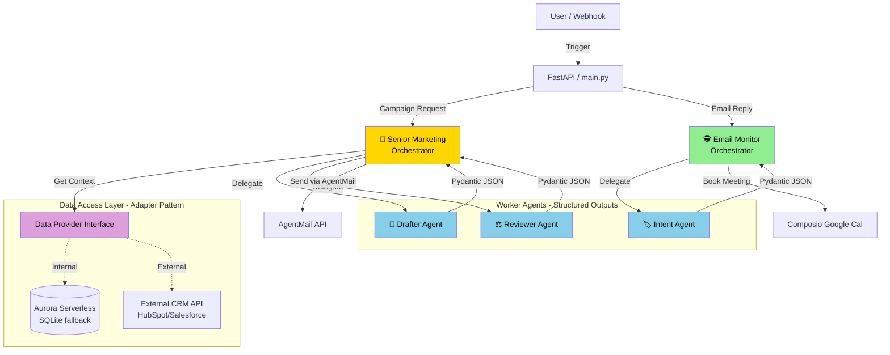

# SDR Platform: Production Implementation Gameplan

Welcome to the production hardening track for the SDR (Sales Development Representative) AI Platform. This document serves as the master checklist and architectural blueprint as we upgrade the system from a prototype to an enterprise-grade SaaS application, adhering to the "Alex" architecture principles.

## 🏗️ System Architecture

Our upgraded architecture implements the Orchestrator-Worker pattern, robust data layers, and structured AI outputs.



## 📋 Implementation Progress

We are executing this upgrade in 4 distinct phases to ensure stability.

### Phase 1: The Data Layer Upgrade (Adapter Pattern)
- [x] Create `DataProvider` interface.
- [x] Implement `SQLiteProvider` (Current logic).
- [x] Implement skeleton for `CRMProvider` (External API).
- [x] Update Tools to use the injected Data Provider.

### Phase 2: Agent Context & Guardrails (Structured Outputs)
- [x] Refactor Prompts to enforce Chain of Thought (`rationale` field first).
- [x] Update all Agents to return strictly validated Pydantic JSON models.
- [x] Implement Llama Guard AI-based validation guardrails before saving/sending.
- [x] **Smart Calendar Scheduling**: Re-architected meeting booking to fetch staff availability from the database and enforce mathematical alignment of proposed times using JSON availability data, rather than AI hallucination. Email responses now inform the lead that a calendar invite will be sent.

### Phase 3: Production Hardening (Resilience & Observability)
- [ ] Wrap LLM calls in `tenacity` retry loops (Exponential backoff).
- [ ] Convert `logging.info` to structured JSON logs.
- [ ] Implement health check endpoints (`/health/db`, `/health/ai`).

### Phase 4: Orchestration Pattern
- [ ] Split `SeniorMarketingAgent` into Orchestrator and Workers.
- [ ] Implement async decoupling (Background tasks for heavy AI jobs).

---

## 🧪 Local Testing & Health Checks Guide

### Phase 1: Testing the Data Layer
Currently, the `lead_service.py` is fully decoupled.
You can test the system locally exactly as before, since it falls back to the database.

To test the CRM dummy logic:
```bash
export DATA_SOURCE=CRM
uv run python main.py
```
*Note: Any agent asking for a lead will now get the dummy CRM lead.*

### Aurora Serverless v2 PostgreSQL Setup Guide
To migrate off SQLite and use Aurora Serverless (based on the Alex Architecture):

**1. AWS Permissions**
Ensure your AWS IAM User has RDS and Data API permissions:
- `AmazonRDSDataFullAccess`
- `SecretsManagerReadWrite`

**2. Terraform Deployment**
Create a `terraform/database` folder.
Use `aws_rds_cluster` with `engine = "aurora-postgresql"` and `serverlessv2_scaling_configuration`.
Enable the Data API: `enable_http_endpoint = true`.

**3. Update Settings**
Once deployed, Terraform will output a Cluster ARN and a Secret ARN.
Add these to your `.env` file (you will need to update `utils/db_connection.py` to use `boto3` `rds-data` client instead of `sqlite3` when these are present):
```env
DB_CLUSTER_ARN="arn:aws:rds:us-east-1:123456789:cluster:sdr-cluster"
DB_SECRET_ARN="arn:aws:secretsmanager:us-east-1:123456789:secret:sdr-secret"
```

### Phase 3: Testing Health Checks
*Pending Implementation...*
