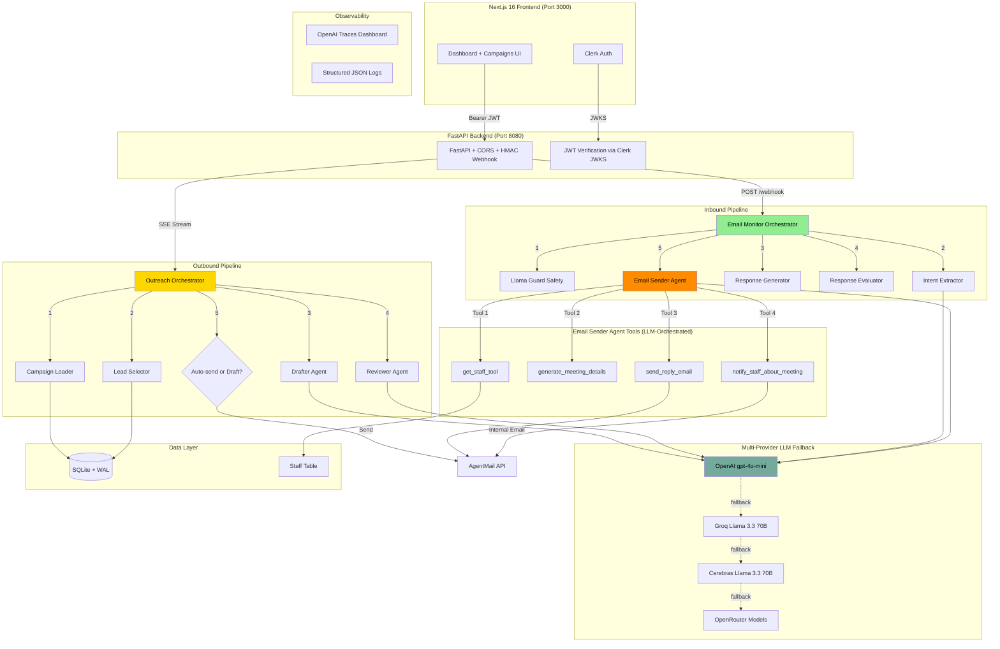

# SDR Platform — Architecture & Implementation

An AI-powered Sales Development Representative platform that automates outbound email campaigns and intelligently processes inbound replies using the **Orchestrator-Worker** pattern with the **OpenAI Agents SDK**.

## System Architecture



## Technology Stack

| Layer | Technology | Version | Purpose |
|-------|-----------|---------|---------|
| **Frontend** | Next.js (App Router) | 16.2.4 | Dashboard, campaign management |
| | React | 19.2.4 | UI rendering |
| | Tailwind CSS | ^4 | Styling |
| | TypeScript | ^5 | Type safety |
| **Authentication** | Clerk (`@clerk/nextjs`) | ^7.2.5 | Sign-in/sign-up, JWT for API calls |
| | `python-jose` | >=3.5.0 | Backend JWT verification via JWKS |
| **Backend** | FastAPI | >=0.104.0 | REST API, SSE streaming, webhook handler |
| | Uvicorn | >=0.24.0 | ASGI server |
| | Pydantic / Pydantic Settings | >=2.5.0 | Config, structured agent outputs, validation |
| **AI Orchestration** | OpenAI Agents SDK (`openai-agents`) | >=0.13.2 | Agent framework: Runner, tools, tracing |
| | OpenAI Python SDK (`openai`) | >=1.0.0 | LLM API calls, AsyncOpenAI for custom providers |
| | Tenacity | >=9.1.4 | Retry with exponential backoff |
| **Email** | AgentMail (`agentmail`) | latest | Send, reply, thread management, webhooks |
| **Database** | SQLite3 | stdlib | Leads, campaigns, staff, email messages, events |
| **Safety** | Llama Guard (LLM-based) | — | Prompt injection detection, content safety |
| **Tunnel** | Ngrok | v3 | Expose local webhook endpoint to AgentMail |
| **Tracing** | OpenAI Traces | — | Full pipeline visibility (separate key support) |
| **Logging** | Python `logging` | stdlib | Rotating JSON file logs + console |

## LLM Provider Fallback Chain

The system uses a multi-provider fallback strategy with provider-specific capability filtering:

| Priority | Provider | Model | Capabilities | Skipped For |
|----------|----------|-------|-------------|-------------|
| **1 (Primary)** | OpenAI | `gpt-4o-mini` | Tool calling, structured output, generation | — |
| 2 | Groq | `llama-3.3-70b-versatile` | Tool calling, generation | Structured output (`json_schema`) |
| 3 | Cerebras | `llama-3.3-70b` | Structured output, generation | Tool calling |
| 4+ | OpenRouter | Meta Llama, DeepSeek, Google, Anthropic | Varies | Cross-blacklisted on 402 |

**Resilience features:**
- **Multi-key support**: Groq and Cerebras accept comma-separated keys for round-robin fallback
- **Provider blacklisting**: Fatal errors (quota, TPD limits) trigger 5-minute blacklists
- **Cross-blacklisting**: OpenRouter providers share credits; one 402 blacklists all
- **Fast skip**: `max_retries=0` on custom providers, 2-attempt tenacity with short backoff
- **Separate tracing key**: `OPENAI_TRACING_KEY` env var sends traces to your own OpenAI account

## Pipeline Details

### 1. Outbound Outreach Pipeline

**Trigger**: `GET /api/outreach/stream` (SSE) from the frontend dashboard.

**Flow**:
1. **Campaign Loader** — Fetches active campaign from SQLite (by name or random)
2. **Lead Selector** — Picks an eligible lead (`fetch_lead_info`)
3. **Drafter Agent** — Generates 3 email variants (professional, engaging, concise) as structured `DraftsResponse`
4. **Reviewer Agent** — Selects the best draft with rationale as structured `ReviewResponse`
5. **Send or Draft** — If `REQUIRE_HUMAN_APPROVAL=true`, saves to approval queue; otherwise sends via AgentMail
6. **Lead Update** — Updates `touch_count`, `last_contacted_at`, `emails_sent`, and lead status

**Files**: `outreach/marketing_agent.py`, `outreach/workers.py`, `tools/campaign_tools.py`, `tools/lead_tools.py`

### 2. Inbound Email Monitor Pipeline

**Trigger**: `POST /webhook` from AgentMail (via Ngrok tunnel).

**Flow**:
1. **HMAC Validation** — Optional webhook signature verification
2. **Deduplication** — Skips already-processed or system-generated messages
3. **Metadata Extraction** — Normalizes webhook payload (`email_monitor/data_utils.py`)
4. **Llama Guard Safety Check** — LLM-based prompt injection and content safety scan (fail-closed)
5. **Intent Extraction** — Classifies as `meeting_request`, `question`, `interest`, `neutral`, `opt_out`, `spam`, or `bounce` with confidence score
6. **Conversation History** — Fetches thread history from AgentMail API
7. **Response Generation** — Crafts contextual reply using email metadata, intent, and history
8. **Response Evaluation** — Second LLM pass: approve/reject for tone, accuracy, completeness (up to 2 retries on rejection)
9. **Email Sender Agent** (LLM-driven tool orchestrator):
   - For **meeting requests**: Calls 4 tools sequentially — `get_staff_tool` → `generate_meeting_details` → `send_reply_email` → `notify_staff_about_meeting`
   - For **other intents**: Calls `send_reply_email` only
10. **Lead Update** — Updates `last_inbound_at`, promotes status (`WARM`, `MEETING_BOOKED`, `OPTED_OUT`)

**Files**: `email_monitor/monitor.py`, `email_monitor/intent_extractor.py`, `email_monitor/email_response.py`, `email_monitor/response_evaluator.py`, `email_monitor/email_sender.py`

### 3. Meeting Coordination (Human-in-the-Loop)

Instead of AI-driven Google Calendar creation, the system uses a human-in-the-loop approach:

1. **`generate_meeting_details`** — LLM proposes a time based on staff availability from the DB
2. **`send_reply_email`** — Client receives proposed meeting details with option to request changes
3. **`notify_staff_about_meeting`** — Staff member receives an internal email with all meeting details and instructions to create the Google Calendar invite manually

This avoids token-expensive Composio/Google Calendar API calls and eliminates false "calendar invite sent" claims.

## Safety & Guardrails

| Layer | Mechanism | Behavior |
|-------|-----------|----------|
| **Llama Guard** | LLM-based safety check (`LlamaGuardResult`) | Scans inbound emails; fail-closed on errors |
| **Response Evaluator** | Second LLM pass on outbound replies | Rejects false calendar claims, inappropriate tone |
| **Calendar Claim Rewriter** | Regex pre-processing (`_rewrite_calendar_claims`) | Removes "invite sent" claims before agent sees text |
| **Forbidden Phrases** | Configurable phrase list check | Blocks outbound emails with banned content |
| **Opt-out Footer** | Auto-appended to client-facing emails | Skipped for internal (`internal=True`) staff emails |
| **Daily Email Limits** | In-memory counter per process | Prevents runaway sends (default: 200/day) |
| **Word Cap** | `max_words_per_email` truncation | Keeps emails concise |

## Database Schema

SQLite with WAL mode. Tables: `leads`, `campaigns`, `campaign_leads`, `email_messages`, `meetings`, `staff`, `events`.

Key relationships:
- `campaign_leads` links campaigns to leads with `emails_sent` tracking
- `email_messages` stores all sent/draft/inbound messages with approval status
- `staff` stores team members with timezone and JSON availability for meeting scheduling
- `events` provides an audit log of system actions

## API Endpoints

| Endpoint | Method | Auth | Purpose |
|----------|--------|------|---------|
| `/health` | GET | No | Health check |
| `/api/campaigns` | GET/POST | JWT | List and create campaigns |
| `/api/campaigns/{id}` | GET/PUT/DELETE | JWT | Campaign CRUD |
| `/api/outreach/stream` | GET (SSE) | Token | Trigger outreach with real-time progress |
| `/webhook` | POST | HMAC | AgentMail inbound email webhook |
| `/api/webhooks/stream` | GET (SSE) | Token | Real-time webhook event log stream |
| `/api/drafts` | GET | JWT | List email drafts pending approval |
| `/api/drafts/{id}/approve` | POST | JWT | Approve a draft email |

## Environment Variables

```env
# Core
OPENAI_API_KEY=sk-...              # Primary LLM provider
OPENAI_TRACING_KEY=sk-...          # Separate key for traces (optional)
AGENTMAIL_API_KEY=am_...           # Email sending/receiving
AGENTMAIL_INBOX_ID=...@agentmail.to

# Authentication
NEXT_PUBLIC_CLERK_PUBLISHABLE_KEY=pk_test_...
CLERK_SECRET_KEY=sk_test_...
CLERK_JWKS_URL=https://....clerk.accounts.dev/.well-known/jwks.json

# Fallback providers (optional, comma-separated for multi-key)
GROQ_API_KEY=gsk_key1,gsk_key2
CEREBRAS_API_KEY=csk_key1,csk_key2
OPENROUTER_API_KEY=sk-or-...

# Model configuration
INTENT_MODEL=gpt-4o-mini
RESPONSE_MODEL=gpt-4o-mini

# Guardrails
MAX_WORDS_PER_EMAIL=200
FORBIDDEN_PHRASES=guaranteed ROI,100% guarantee,no risk
DAILY_EMAIL_LIMIT=200
REQUIRE_HUMAN_APPROVAL=true

# Database
DATABASE_URL=sqlite:///./db/sdr.sqlite3
```

## Local Development

### Prerequisites
- Python >=3.12, `uv` package manager
- Node.js (for Next.js frontend)
- Ngrok (for webhook tunnel)

### Running Locally (3 terminals)

**Terminal 1 — Backend:**
```bash
cd /path/to/SDR
uv run uvicorn main:app --host 0.0.0.0 --port 8080 --reload
```

**Terminal 2 — Frontend:**
```bash
cd /path/to/SDR/frontend
npm run dev
```

**Terminal 3 — Ngrok Tunnel:**
```bash
cd /path/to/SDR
./ngrok http 8080
```

Then set the Ngrok URL as your AgentMail webhook: `https://xxxx.ngrok-free.app/webhook`

### Viewing Traces
- Set `OPENAI_TRACING_KEY` in `.env` to your own OpenAI key
- Visit https://platform.openai.com/traces after running a pipeline

### Viewing Logs
```bash
tail -f logs/squad3.log | jq .
```

## Implementation Progress

### Phase 1: Data Layer (Adapter Pattern)
- [x] `LeadProvider` abstract interface (`services/data_provider.py`)
- [x] `DBLeadProvider` with SQLite (`services/lead_service.py`)
- [x] `CRMLeadProvider` skeleton for HubSpot/Salesforce integration
- [x] All tools use injected data provider

### Phase 2: Structured Outputs & Guardrails
- [x] Chain-of-thought `rationale` field on all agent outputs
- [x] Pydantic models for all agent responses (`EmailIntent`, `EmailResponse`, `ResponseEvaluation`, `MeetingDetails`, etc.)
- [x] Llama Guard AI safety check on inbound emails
- [x] Response Evaluator second-pass quality gate

### Phase 3: Production Hardening
- [x] Tenacity retry loops with exponential backoff
- [x] Structured JSON file logging with rotation
- [x] Health check endpoints
- [x] HMAC webhook signature validation
- [x] CORS configuration via environment variable
- [x] JWKS TTL refresh (hourly)
- [x] Bounded SSE queues (256 messages)

### Phase 4: Orchestrator-Worker Pattern
- [x] Outreach: Orchestrator → Drafter → Reviewer → Send/Draft
- [x] Monitor: Safety → Intent → Response → Evaluate → Send (with tool-calling agent)

### Phase 5: Authentication & Multi-Provider Fallback
- [x] Clerk JWT verification on all API endpoints
- [x] SSE query-string token fallback for EventSource
- [x] OpenAI-first provider fallback with capability filtering
- [x] Provider blacklisting with cross-blacklisting for OpenRouter
- [x] Multi-key support for Groq and Cerebras
- [x] Separate `OPENAI_TRACING_KEY` for trace export

### Phase 6: Pipeline Integrity & Meeting Coordination
- [x] DB connection caching (schema bootstrap once per process)
- [x] Lead lifecycle tracking (touch count, status promotion, opt-out)
- [x] Inbound email matching and `email_messages` logging
- [x] Email guardrails enforcement (daily limits, forbidden phrases, word cap, opt-out footer)
- [x] Human-in-the-loop meeting coordination (staff notification instead of AI calendar creation)
- [x] Calendar claim rewriting (regex pre-processing)
- [x] Staff exclusion filter (prevents notifying client as staff)
- [x] Internal email flag (bypasses safety check and opt-out footer for staff notifications)
- [x] Tool call tracking fix (`call_id` matching for ToolCallItem/ToolCallOutputItem)
